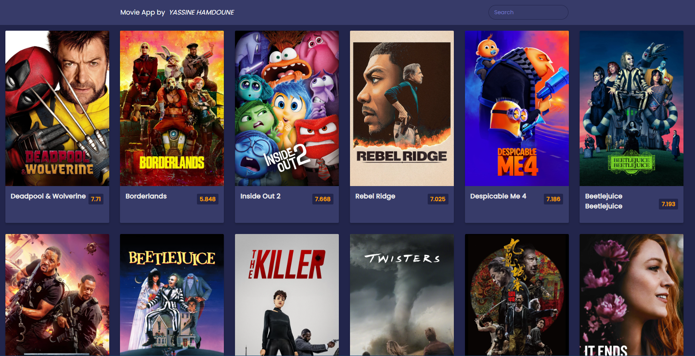

<!-- Title and Description -->
<h1 align="center">
  Movie App
   
</h1>

  A movie discovery app built with HTML, CSS, and JavaScript.

<!-- Screenshots -->
<h2 align="center">Screenshots</h2>

  

<!-- Description and Features -->
<h2 align="center">Description</h2>

  This Movie App allows users to discover popular movies with an intuitive and sleek design. It showcases a grid of
  movies with their posters, titles, and ratings. Users can view a brief synopsis when selecting a movie, providing an
  easy way to explore new films.

<h2 align="center">Features</h2>

<ul>
  <li>🎥 Displays popular movies with posters and ratings</li>
  <li>💬 Overview section with brief movie descriptions</li>
  <li>📱 Responsive design for a great experience on both mobile and desktop devices</li>
  <li>🎬 Easy navigation through movie selections</li>
  <li>⭐ Movies are sorted by ratings</li>

</ul>

 <!-- Technologies Used -->
<h2 align="center">Technologies Used</h2>

 HTML, CSS, JavaScript 
 <!-- Installation Instructions -->
<h2 align="center">Installation</h2>

 To run the app locally, follow these steps: 

<ol>
  <li>Clone the repository:
    <pre><code>https://github.com/yacinova/movie-app.git</code></pre>
  </li>
  <li>Navigate to the project directory:
    <pre><code>cd movie-app </code></pre>
  </li>
  <li>Start the app: Open <u><b>index.html</b></u> in your browser. </li>
</ol>

Made with ❤️ by YASSINE HAMDOUNE

 Contact: <a href="mailto:hamdouneyassine.03@gmail.com">hamdouneyassine.03@gmail.com</a> 
